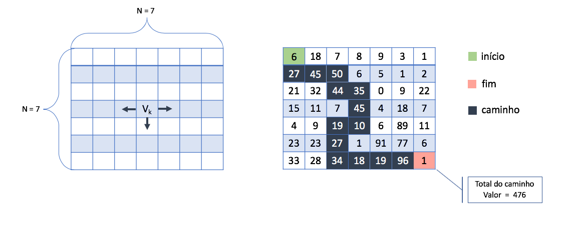

# Algoritimo Guloso: Contando Instruções

 
 

<b>Algoritmo guloso</b> ou míope é técnica de projeto de algoritmos que tenta resolver o problema fazendo a escolha localmente ótima em cada fase com a esperança de encontrar um ótimo global.

Na solução de alguns problemas combinatórios a estratégia gulosa pode assegurar a obtenção de soluções ótimas, o que não é muito comum. No entanto, quando o problema a ser resolvido pertencer à classe NP-completo ou NP-difícil, a estratégia gulosa torna-se atrativa para a obtenção de solução aproximada em tempo polinomial.

O progama disponibilizado é um algoritimo guloso ele pega uma matriz NxN, sendo N um valor fornecido como entrada do progama, e vai do início(0,0) até o final(N,N) somando o valor de cada célula passada para chegar no final e mostra o valor total do caminho no final. O progama tem as seguintes regras:

1. O valor de cada célula é um número entre 0 e 99.

2. O próximo valor pode ser o que está na mesma linha e imediatamente à direita, imediatamente à esquerda, bem como, o que está na coluna abaixo do numero corrente.

3. Há apenas uma exceção de percurso. Ao chegar na última linha deve-se percorre-la até o fim sem realizar mais migrações para colunas acima. 

Observe um exemplo logo abaixo para uma matriz com N = 7.

 

# Compilação e Execução

O progama disponibilizado possui um arquivo Makefile que realiza todo o procedimento de compilação e execução. Para tanto, temos as seguintes diretrizes de execução:

| Comando                |  Função                                                                                           |                     
| -----------------------| ------------------------------------------------------------------------------------------------- |
|  `make clean`          | Apaga a última compilação realizada contida na pasta build                                        |
|  `make`                | Executa a compilação do programa utilizando o gcc, e o resultado vai para a pasta build           |
|  `make run`            | Executa o programa da pasta build após a realização da compilação                                 |

